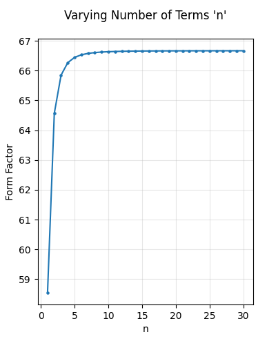

# Material Science Form-Factor Calculator
Calculate the form-factor coeffcient numerically for a sample of material, for use in empirical determination of the materials shear modulus.

## Table of Contents
- [Introduction](#introduction)
- [Installation](#installation)
- [Usage](#usage)
- [Equations](#equations)
- [Effect of number of terms on accuracy](#effect-of-number-of-terms-on-accuracy)
- [License](#license)
- [Contributions](#contributions)
- [Contact](#contact)

## Introduction 
In material physics, the term "form-factor" typically denoted with the variable 'F' is a dimensionless quantity used in the study of materials and their dynamic properties. The form factor plays a crucial role in understanding the material's behavior under various physical conditions, including its response to external forces.

The form factor is a function of the samples dimensions from which the function takes into account the samples cross-sectional area, volume, surface area and aspect ratio. Making the form factor an essential concept in material physics and engineering.

## Usage
This repo provides a python function called find_form_factor that approximates the form factor for a rectangular strip or a circular rod, made of a homogeneous isotropic material. To use the find_form_factor function, you need to provide the following arguments:

#### Parameters:
- 'length': The length of the material strip or rod in meters.
- 'width': The width of the rectangular strip or the diameter of the rod in meters.
- 'shape' (optional): Shape of the material sample. Default is 'strip'. Available options are 'strip' or 'rod'.
- 'terms' (optional): The number of terms to use in the summation for the case of a strip. Default is 10, which has shown to be the best trade off between speed and accuracy.

#### Returns
It will return the calculated aproximate form factor as a float.

## Equations
The form factor is calculated using the following equations:

**Thin rectangular strip**
The form factor for a thin rectangular strip is given by the formula,

$$F = cab^3$$

where c is given by,

$$c\left(a, b\right) = \frac{1}{3} \left[\frac{1 - 192b}{π^5 a} ∑_{n=0}^{∞} \frac{1}{(2n+1)^5} \tanh \frac{(2n+1)πa}{2b}\right]$$

as set out in Read, B. E., and G. D. Dean. "The Determination of Dynamic Properties of Polymers and Composites, Adam Hilger, Ltd." Herts, England (1978).

**Rod with circular cross section**
The form factor for a rod with circular cross section is given by the formula,

$$F = \frac{\pi a^4}{2} $$

where b is the diameter of the rod. This is greatly simplified due to symetry of the cross section. Equation taken from "University of Bristol - Dynamic Lab Manual II" (2021)

## Effect of number of terms on accuracy
In the case of the rectangular strip the form factor is calculated using a summation of an infinite series. Therfore we must make some approximation to the infinite series to calculate the form factor. The approximation is made by truncating the infinite series at a finite number of terms. Testing of the function shows that the result converges after approximatly 10 terms, which is why it is chosen for the default value, as the best trade off between speed and accuracy. Users are able to set this value higher or lower using the argument 'number_of_terms' to increase either the speed or accuracy of the calulation. The following plot show the dependance of the form factor on the number of terms used in the summation.

## License
Form-Factor Calculator is distributed under the MIT License. See the [LICENSE](LICENSE) file for more details.

## Contributions
Contributions to this Form-Factor Calculator are welcome! If you encounter any issues or have suggestions for improvements, or new sample shapes we can compute please open an issue or a pull request on the [GitHub repository](https://github.com/adillwma/Material_Science_Form_Factor_Calculator).

## Contact
For any inquiries, feel free to reach out to me at adillwmaa@gmail.com.

